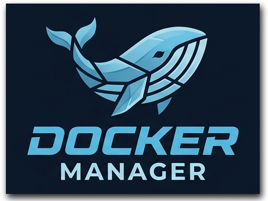
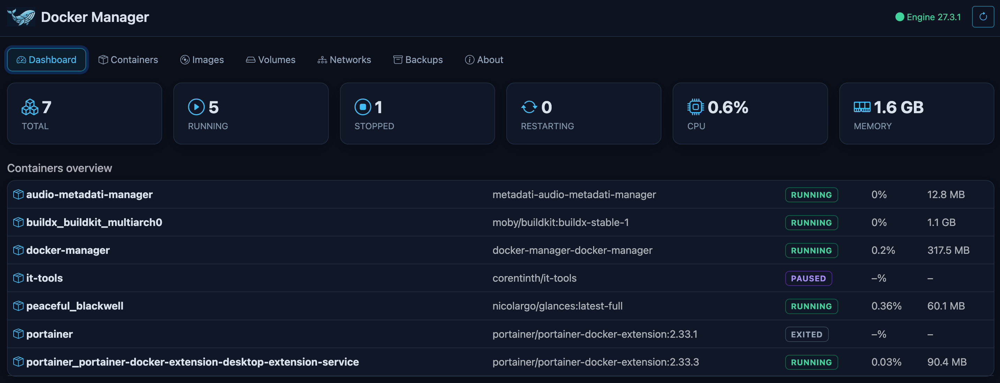
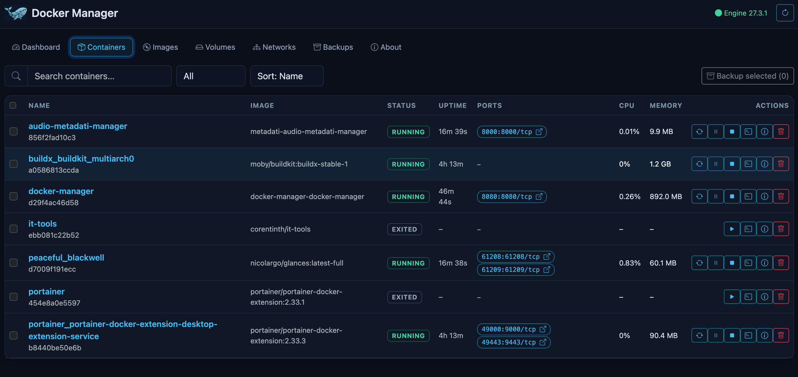
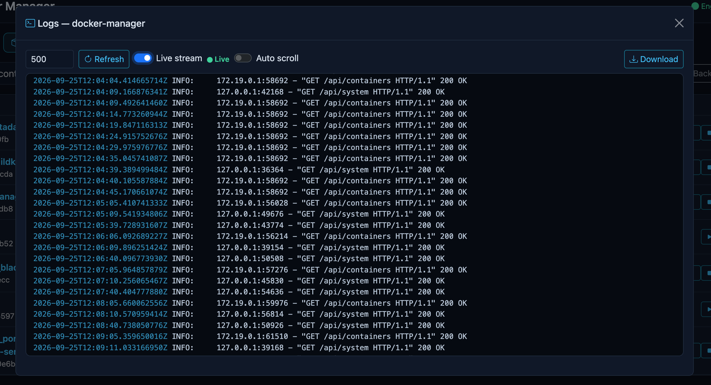
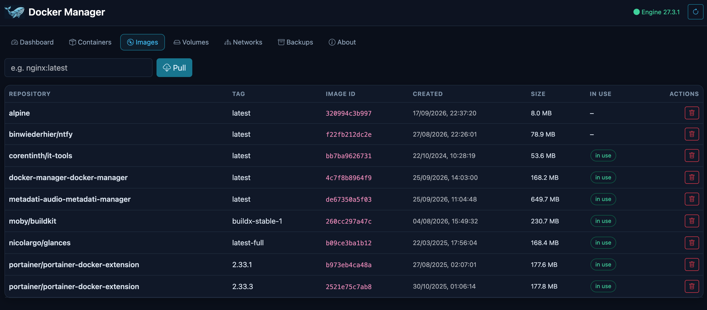
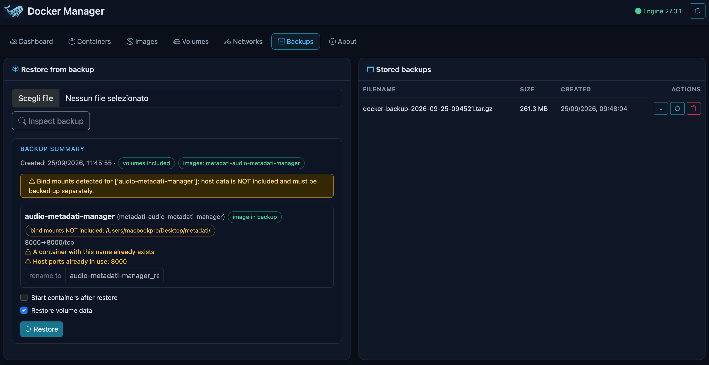
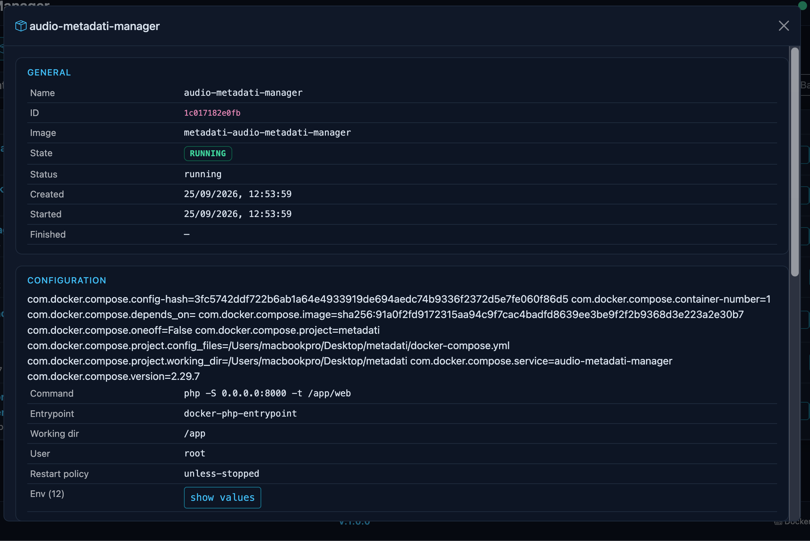
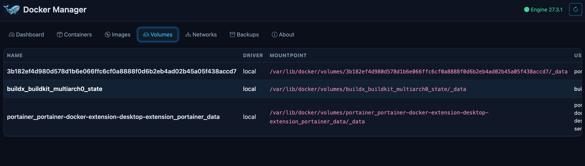
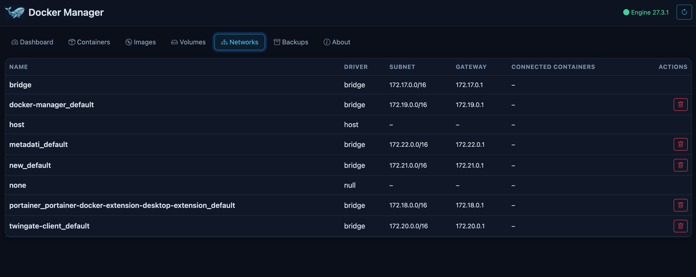

<p align="center">
  
</p>

<h1 align="center">Docker Manager</h1>

<p align="center">
  Lightweight web interface for managing Docker containers
</p>

A small, self-hosted web interface for monitoring and managing Docker
containers, images, volumes and networks on a single machine. Built with
**FastAPI** (Python backend) and **Bootstrap 5 + vanilla JS** (frontend).
No external database, no cloud services — configuration is plain environment
variables.

Current version: **V.1.0.0**

## Screenshots

### Dashboard

<p align="center">
  
</p>

### Containers 

<p align="center">
  
</p>

### Container logs with live streaming

<p align="center">
  
</p>

### Images 

<p align="center">
  
</p>

### Backup & Restore

<p align="center">
  
</p>

<details>
<summary>More screenshots (details / volumes / networks)</summary>

<p align="center"></p>
<p align="center"></p>
<p align="center"></p>

</details>

## Features

- **Automatic container discovery** — all containers on the local Engine
  appear automatically; no registration needed (polling with live UI updates)
- **Dashboard** — total/running/stopped/restarting counts, aggregate CPU &
  RAM usage, per-container resource overview, and **application cards** for
  each discovered container with clickable names, status badges, and icons
- **Container actions** — start / stop / restart / pause / unpause / kill /
  remove (with confirmation modals)
- **Container details** — config, environment (masked sensitive values +
  opt-in reveal), networks, ports, mounts, restart policy
- **Port visualization** — published ports are listed per container;
  HTTP/HTTPS ports are clickable and open the service in a new browser tab
  using the **same host address** you used to open Docker Manager (never
  assumes `localhost`)
- **Log viewer** — stdout/stderr, selectable line limit (100–5000),
  auto-scroll (can be paused), download, and **live streaming** via WebSocket
  with a `● Live` / `● Disconnected` status indicator
- **Image management** — list (repository, tag, image ID, created, size),
  pull, remove by image ID; dangling `<none>:<none>` images are shown,
  marked as `dangling` and can be removed; images in use by containers
  cannot be deleted accidentally
- **Volume management** — list with mountpoints and which containers use
  them, safe removal (in-use volumes blocked)
- **Network management** — list with subnet/gateway/connected containers,
  safe removal (built-in networks protected)
- **Portable backups** — multi-container selection; exports image(s), full
  container configuration, shared networks/volumes metadata and (optionally)
  volume data into a single `docker-backup-YYYY-MM-DD-HHMMSS.tar.gz`
- **Restore on another host** — upload or pick a stored backup, preview what
  will be restored (images, ports, volumes, env, conflicts), rename
  containers to avoid name conflicts, then restore
- **About page** — application info, backend configuration and Docker Engine
  status; the global footer shows the app version and live engine version/API/OS
- **Search, filter (state) and sort** the container list dynamically
- **Dark, minimal UI** — dark blue/black theme with cyan accents, fully
  responsive (table on desktop, cards on mobile)
- **REST API** with interactive OpenAPI docs at `/docs`
- **Tests** covering API, actions, backup manifest validation and path
  traversal protection

## Technology

- Python 3.12 · FastAPI · Uvicorn · Docker SDK for Python
- HTML5 · Bootstrap 5 · Bootstrap Icons · vanilla JavaScript (no build step)

## Requirements

- Linux host with **Docker Engine** (Docker Desktop works too)
- Access to the Docker Engine socket (`/var/run/docker.sock`)
- Docker Compose (only for the recommended container installation)
- For volume data export/import the `alpine:latest` image is used on the
  host (pull it once if missing: `docker pull alpine`)
- For development only: Python 3.11+

## Installation (Docker — recommended)

```bash
git clone <this-repo> && cd docker-manager
docker compose up -d --build
```

Then open **http://SERVER_IP:8080** (port `8080` as configured in
`docker-compose.yml`).

> ⚠️ **Security Warning**
>
> Docker Manager requires access to the Docker Engine socket. Access to
> `/var/run/docker.sock` provides **highly privileged, root-equivalent
> control over the Docker host**. Only expose Docker Manager to trusted
> networks, or configure appropriate authentication (`AUTH_TOKEN`) and
> access controls (VPN / authenticated reverse proxy). Never expose it to
> the public internet without authentication.

## Configuration

All configuration is via environment variables (see `.env.example`):

| Variable | Default | Description |
|---|---|---|
| `APP_NAME` | `Docker Manager` | Name shown in the UI |
| `APP_VERSION` | `1.0.0` | Application version shown in the footer (single source of truth) |
| `HOST` / `PORT` | `0.0.0.0` / `8080` | Listen address |
| `DOCKER_SOCKET` | `unix:///var/run/docker.sock` | Engine socket |
| `BACKUP_DIR` | `/app/backups` | Where backups are stored |
| `POLL_INTERVAL` | `5` | Frontend refresh interval (seconds) |
| `LOG_DEFAULT_LINES` | `500` | Default log tail |
| `MAX_UPLOAD_MB` | `4096` | Max restore upload size |
| `AUTH_TOKEN` | *(empty = no auth)* | Bearer token protecting API/UI |
| `LOG_LEVEL` | `INFO` | Backend log level |

Copy `.env.example` to `.env` and adjust. `docker-compose.yml` forwards
`AUTH_TOKEN` automatically.

## Container ports

Published container ports appear in the **Ports** column of the Containers
page as `HOST_PORT:CONTAINER_PORT/tcp`. TCP ports are clickable
(`3000:3000/tcp ↗`) and open the service at
`http(s)://<host-you-are-using>:<host-port>` — i.e. the same address you use
to reach Docker Manager, so it also works when Docker Manager is accessed
remotely (e.g. `http://192.168.0.234:8080` → `http://192.168.0.234:3000`).
Ports mapped to `443`/`8443` are opened via `https`. Unpublished or non-TCP
ports are displayed but not clickable.

## Logs

- Normal logs with a selectable tail (100 / 500 / 1000 / 5000 lines),
  timestamps and download as `.txt`.
- **Live stream** toggle streams new log lines in real time over a WebSocket
  (`/api/containers/{id}/logs/stream`), backed by the Docker SDK follow
  stream (`docker logs --follow` equivalent). A `● Live` / `● Disconnected`
  indicator shows the connection state. Closing the log window, disabling
  the toggle or switching containers terminates the stream — no connection
  leaks.
- **Auto scroll** follows new lines and can be paused independently.

## Dashboard Application Configuration

Each discovered container gets an application card on the Dashboard. Additionally, you can create **manual applications** for external services or services not running as Docker containers. Click the **+ Add application** button on the Dashboard or the pencil icon on an existing card to configure:

- **Display Name** — defaults to the container name for Docker-backed apps; empty for manual apps. Editable.
- **URL** — if set, the card name becomes a link. For Docker-backed apps, if left empty, a URL is **automatically inferred** from the container's published TCP ports (e.g. `http://host:8080`). Saved URLs take priority over inferred ones. Inferred URLs are never persisted. Manual apps have no inferred URL.
- **Description** — optional text shown on the card.
- **Icon** — search and select from [selfh.st](https://selfh.st/icons/) icons. For Docker-backed apps, if no icon is selected, one is **automatically matched** from the container name (e.g. `grafana` → Grafana icon). Falls back to the default logo. Manual apps use the explicit icon or the default logo.
- **Group** — optional logical group for organizing cards. Type to see suggestions from existing groups (case-insensitive, prefix matches first). Users may still enter a new group name.
- **Order** — display order within the group (lower numbers first).

Click the **Delete** button (red trash icon) in the configuration modal to remove a tile. A confirmation dialog shows the current display name. Deleting a tile removes its dashboard configuration from `BACKUP_DIR/dashboard-apps.json` but **never stops or removes the underlying Docker container or image**.

**Duplicate display names are not allowed** — names are compared case-insensitively and with whitespace trimmed. The current application is excluded when updating, so saving an unchanged name is always allowed.

Configuration is saved to `BACKUP_DIR/dashboard-apps.json` on the server and survives browser refresh and container restarts. Manual applications persist across reloads and backend restarts and do not require a Docker container.

## Images

The Images page lists repository, tag, image ID, creation date, size and
whether a container uses the image. Deletion always addresses the **image
ID**, never a constructed `repo:tag` string, so dangling images shown as
`<none>` / `<none>` (normal Docker behavior for untagged layers) can be
removed just like tagged ones. Images with multiple tags or images in use by
containers produce a clear error unless force removal is confirmed.

## Backup & Restore

A backup is a single portable tarball (`docker-backup-YYYY-MM-DD-HHMMSS.tar.gz`):

```
manifest.json                  # version, containers, images, volumes, warnings
containers/<name>/config.json  # full recreate configuration (env, ports, …)
images/image_N.tar             # exported images (docker save)
volumes/<name>.tar.gz          # volume data (optional)
README.txt
```

So a backup can contain: the image, the container configuration
(environment, ports, restart policy, command), network and volume metadata,
volume data and a manifest describing everything.

**Docker volumes vs. bind mounts:** named Docker volume *data* can be
included in the backup ("Include volume data"). **Host bind mounts** are
configuration-only: the mount is recreated on restore, but the host
filesystem data itself is *not* portable and must be backed up separately.
The UI and the manifest warnings state this explicitly.

**Restore:** Backups → upload a `.tar.gz` (or pick a stored backup) →
*Inspect backup* → review containers, images, ports, volumes and conflicts
→ optionally rename conflicting containers, choose whether to restore
volume data and start containers → *Restore*. Containers with conflicting
names are never silently overwritten.

## API

Interactive docs: `http://SERVER_IP:8080/docs`

```
GET    /api/system
GET    /api/containers                      GET  /api/containers/{id}
POST   /api/containers/{id}/{start|stop|restart|pause|unpause|kill}
DELETE /api/containers/{id}?force=&volumes=
GET    /api/containers/{id}/logs?tail=      GET  /api/containers/{id}/logs/download
WS     /api/containers/{id}/logs/stream     GET  /api/containers/{id}/stats
GET    /api/images        POST /api/images/pull      DELETE /api/images/{id}
GET    /api/images/{id}
GET    /api/volumes       DELETE /api/volumes/{name}
GET    /api/networks      DELETE /api/networks/{name}
POST   /api/backups       GET  /api/backups
GET    /api/backups/{file}/summary          GET  /api/backups/{file}/download
DELETE /api/backups/{file}
POST   /api/restore/preview                 POST /api/restore
GET    /api/dashboard/apps                  GET  /api/dashboard/apps/{id}
POST   /api/dashboard/apps                  PUT    /api/dashboard/apps/{id}
DELETE /api/dashboard/apps/{id}
```

## Project structure

```
docker-manager/
├── backend/app/
│   ├── main.py            # FastAPI entrypoint
│   ├── config.py          # env-based settings (incl. APP_VERSION)
│   ├── docker_service.py  # Docker SDK wrapper (mockable)
│   ├── backup.py          # portable backup creation/validation
│   ├── restore.py         # restore logic (safe extraction)
│   ├── auth.py            # optional bearer auth
│   ├── deps.py            # shared dependencies / error mapping
│   └── routers/           # containers / resources / backups
├── frontend/static/       # index.html, app.js, style.css, logos
├── docs/screenshots/      # README screenshots
├── backups/               # stored backups (bind-mounted)
├── tests/                 # API + backup tests (mocked)
├── Dockerfile
├── docker-compose.yml
├── .env.example
└── requirements.txt
```

## Development

```bash
python3 -m venv .venv && source .venv/bin/activate
pip install -r requirements.txt
cp .env.example .env
BACKUP_DIR=./backups uvicorn backend.app.main:app --reload --port 8080
```

Run tests:

```bash
pytest tests -q
```

The Docker client is abstracted in `backend/app/docker_service.py`, so the
test suite runs fully mocked — no Docker daemon required.

## Troubleshooting

| Symptom | Fix |
|---|---|
| "Docker Engine is not available" | Check the socket mount `-v /var/run/docker.sock:/var/run/docker.sock` and that Docker is running |
| Permission denied on socket | Add the container user to the `docker` group or adjust socket permissions |
| Volume backup fails | `docker pull alpine` (helper image used for volume export) |
| Restore fails: port in use | Stop the conflicting container or edit ports after restoring |
| "Image is currently used by container" | Remove/stop the container first, or confirm force removal |
| Live stream shows "Disconnected" | Check the container still exists/runs and `docker logs docker-manager` |
| UI shows "disconnected" | Check container logs: `docker logs docker-manager` |

## Roadmap (planned, not yet implemented)

- Docker Compose project management
- Multiple Docker hosts
- Scheduled backups & backup retention
- Update notifications / ntfy notifications
- Container health monitoring & more detailed resource graphs
- Built-in authentication/authorization beyond a single bearer token

## License

See the repository for license information.
